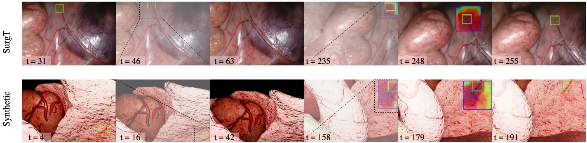

# CL-VaE Tracking

## Requirements

This code has been developed under Python 3.8.16, PyTorch 2.0.1 and CUDA 11.7 on Ubuntu 20.04. 

1. Create a new custom environment:

    * Conda (**Recommended**):
    ```shell
    conda create -n clvae python==3.8.16
    conda activate clvae
    conda install pytorch==2.0.1 torchvision torchaudio pytorch-cuda=11.7 -c pytorch -c nvidia
    conda install cycler kiwisolver six requests
    ```
    **Note**: In case you encounter errors with Pytorch (e.g. `ImportError undefined symbol: iJIT_NotifyEvent`, you may try to install it with `pip` instead of `conda`)
    
    or
    
    * Virtualenv:
    ```shell
    # Install python3.8 if not installed already
    sudo apt update && sudo apt install software-properties-common -y
    sudo add-apt-repository ppa:deadsnakes/ppa && sudo apt update
    sudo apt install python3.8 python3.8-venv python3.8-dev

    # Create environment
    python3.8 -m virtualenv clvae
    source clvae/bin/activate
    pip install torch==2.0.1+cu117 torchvision torchaudio --index-url https://download.pytorch.org/whl/cu117
    pip install cycler kiwisolver six requests
    ```

2. Install system requirements
    ```shell
    sudo apt-get update
    sudo apt-get install -y libsm6 libxext6 libxrender-dev libgl1-mesa-glx libgtk2.0-0
    ```

3. Clone the repository in home directory
    ```shell
    cd ~
    git clone https://github.com/Essex-AI-Innovation-Centre/cl-vae-tracking.git
    ```

4. Install required packages
    ```shell
    pip install -r requirements.txt
    ```
    
5. Build VOLDOR, by following the guidelines [here](VOLDOR/README.md).

6. Add folder to python path to import stuff easily, regardless of your working directory (caution for synonymies!)
    ```shell
    echo '' >> ~/.bashrc && echo 'export PYTHONPATH=$PYTHONPATH:~/cl-vae-tracking' >> ~/.bashrc
    ```

    For example by using:
    ```python
    from neuflow.NeuFlow.neuflow import NeuFlow
    ```

## Training
Follow the instructions in [clvae/README.md](clvae/README.md).

## Testing

Follow the instructions in [online/README.md](online/README.md).
